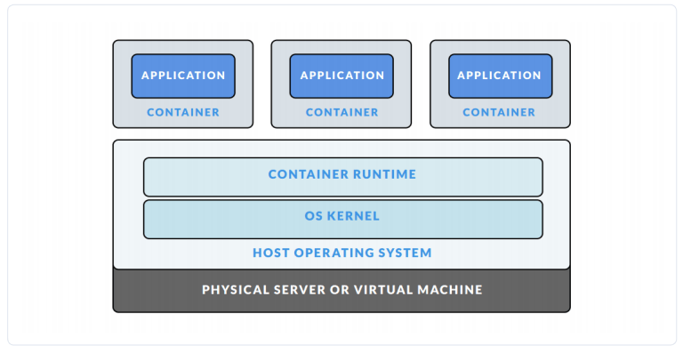

# Quá trình hình thành
1. Ngày lâu lâu rồi, mô hình máy chủ thường là máy chủ vật lý + hệ điều hành(OS) + application
```
application
operation system
physical server
```
Vấn đề gặp phải ở đây là lãng phí tài nguyên, một máy chủ chỉ cài được một OS, cho dù có ổ cứng khủng, ram khủng thì cũng không tận dụng hết lợi thế.

2. Sau đó ra đời công nghệ ảo hóa `vitualization` [link](https://viblo.asia/uploads/f83e4a3a-bc95-4a4d-af37-dbaa9e03d28f.png)


- Vitual machine: loại máy ảo, linux, window, Mac
- Hypervisor(vnware,...): 1 ứng dụng  phần mềm chịu trách nhiệm chạy nhiều máy ảo trên 1 hệ thống
- vitualization: ảo 

- Về tài nguyên: Khi bạn chạy máy ảo, bạn phải cung cấp "cứng" dung lượng ổ cứng cũng như ram cho máy ảo đó, bật máy ảo lên để đó không làm gì thì máy thật cũng phải phân phát tài nguyên

3. Ở bước tiến hóa tiếp theo, người ta sinh ra công nghệ `containerlization` thùng chứa hoá


- Với công nghệ này, trên một máy chủ vật lý, ta sẽ sinh ra được nhiều máy con (giống với công nghệ ảo hóa vitualization), nhưng tốt hơn ở chỗ là các máy con này (Guess OS) đều dùng chung phần nhân của máy mẹ (Host OS) và chia sẻ với nhau tài nguyên máy mẹ.
- Có thể nói là khi nào cần tài nguyên thì được cấp, cần bao nhiêu thì cấp bấy nhiêu, như vậy việc tận dụng tài nguyên đã tối ưu hơn. Điểm nổi bật nhất của containerlization là nó sử dụng các container, và một kĩ sư của Google đã phát biểu rằng: 

4. Container là gì
    - Các phần mềm, chương trình sẽ được Container Engine ( là một công cụ ảo hóa tinh gọn được cài đặt trên host OS) đóng gói thành các container
    - Thế Container là gì, nó là một giải pháp để chuyển giao phần mềm một cách đáng tin cậy giữa các môi trường máy tính khác nhau bằng cách:
        - Tạo ra một môi trường chứa mọi thứ mà phần mềm cần để có thể chạy được.
        - Không bị các yếu tố liên quan đến môi trường hệ thống làm ảnh hưởng tới.
        - Cũng như không làm ảnh hưởng tới các phần còn lại của hệ thống.
    - Bạn có thể hiểu là ruby, rails, mysql ... kia được bỏ gọn vào một hoặc nhiều cái thùng (container), ứng dụng của bạn chạy trong những chiếc thùng đó, đã có sẵn mọi thứ cần thiết để hoạt động, không bị ảnh hưởng từ bên ngoài và cũng không gây ảnh hưởng ra ngoài.
    - Các tiến trình (process) trong một container bị cô lập với các tiến trình của các container khác trong cùng hệ thống tuy nhiên tất cả các container này đều chia sẻ kernel của host OS (dùng chung host OS).
    - Ví dụ, bạn có một app java, bạn sẽ không cần cài đặt JDK vào máy thật để chạy app đó, chỉ cần kiếm container đã được setting tương ứng cho app về, bật nó lên, cho app chạy bên trong môi trường container đó, vậy là ok. Khi không sài nữa thì tắt hoặc xóa bỏ container đó đi, không ảnh hưởng gì tới máy thật của bạn.
5. Ưu điêm:
    - Linh động: Triển khai ở bất kỳ nơi đâu do sự phụ thuộc của ứng dụng vào tầng OS cũng như cơ sở hạ tầng được loại bỏ.
    - Nhanh: Do chia sẻ host OS nên container có thể được tạo gần như một cách tức thì. Điều này khác với vagrant : tạo môi trường ảo ở level phần cứng, nên khi khởi động mất nhiều thời gian hơn.
    -Nhẹ: Container cũng sử dụng chung các images nên cũng không tốn nhiều disks.
    - Đồng nhất :Khi nhiều người cùng phát triển trong cùng một dự án sẽ không bị sự sai khác về mặt môi trường.
    - Đóng gói: Có thể ẩn môi trường bao gồm cả app vào trong một gói được gọi là container. Có thể test được các container. Việc bỏ hay tạo lại container rất dễ dàng.
6. Nhược điểm: độ an toàn
    - Do dùng chung OS nên nếu có lỗ hổng nào đấy ở kernel của host OS thì nó sẽ ảnh hưởng tới toàn bộ container có trong host OS đấy.
    - Ngoài ra hãy thử tưởng tượng với host OS là Linux, nếu trong trường hợp ai đấy hoặc một ứng dụng nào đấy có trong container chiếm được quyền superuser, điều gì sẽ xảy ra? Về lý thuyết thì tầng OS sẽ bị crack và ảnh hưởng trực tiếp tới máy host bị hack cũng như các container khác trong máy đó (hacker sử dụng quyền chiếm được để lấy dữ liệu từ máy host cũng như từ các container khác trong cùng máy host bị hack chẳng hạn).
7. Docker ra đời
    - Công nghệ ảo hóa (vitualization) thì ta có thể dùng công cụ Vitualbox hay VMware thế còn đối với containerlization thì dùng gì đây ? Google họ dùng gì ?
    - Ban đầu được xây dựng trên nền tảng Linux. Vì Docker cần can thiệp vào phần lõi, nhân Kernel trong khí đó Linux là mã nguồn mở, gọi là cần gì có nấy.
    - Hiện tại Docker trên Windows hay Mac thì docker cần cài 1 máy ảo Linux trên máy thật và docker dựa trên máy ảo Linux đó
    - Docker có 2 phiên bản: CE: coder, EE: doanh nghiệp

## Hoạt động
- Docker image là nền tảng của container, có thể hiểu Docker image như khung xương giúp định hình cho container, nó sẽ tạo ra container khi thực hiện câu lệnh chạy image đó. Nếu nói với phong cách lập trình hướng đối tượng, Docker image là class, còn container là thực thể (instance, thể hiện) của class đó.

- Docker có hai khái niệm chính cần hiểu, đó là image và container:
    - Container: Tương tự như một máy ảo, xuất hiện khi mình khởi chạy image.
        - Tốc độ khởi chạy container nhanh hơn tốc độ khởi chạy máy ảo rất nhiều và bạn có thể thoải mái chạy 4,5 container mà không sợ treo máy.
        - Các files và settings được sử dụng trong container được lưu, sử dụng lại, gọi chung là images của docker.
        - Docker Container là instance thực thi một image - các image sẽ biến thành bộ nhớ và được thực thi (image với trạng thái hay tiến tình người dùng).
    - Image: Tương tự như file .gho để ghost win mà mấy ông cài win dạo hay dùng. vd: ubuntu
        - Image này không phải là một file vật lý mà nó chỉ được chứa trong Docker. 
        - Một image bao gồm hệ điều hành (Windows, CentOS, Ubuntu, …) và các môi trường lập trình được cài sẵn (httpd, mysqld, nginx, python, git, …).
        - Docker Image là một gói bao gồm tất cả những thứ cần thiết để chạy một ứng dụng như mã nguồn, thư viện, a runtime, các biến môi trường và các file cấu hình.
    -
    - `Docker hub` là nơi lưu giữ và chia sẻ các file images này (hiện có khoảng 300.000 images)

## Các câu lệnh docker
- `docker pull {image_name}`: Pull một image từ Docker Hub
- `docker run --name {container_name} -p {host_port}:{container_port} -v {/host_path}:{/container_path} -it {image_name} /bin/bash`: Tạo mới một container, đồng thời khởi động với tùy chọn cổng và volume
- VD
```
sudo docker pull ubuntu:16.04

sudo docker run -it ubuntu:16.04 /bin/bash
``` 
- `docker images`: Liệt kê các images hiện có
- `docker rmi {image_id/name}`: Xóa một image
- `docker ps`: Liệt kê các container đang chạy
- `docker ps -a`: Liệt kê các container đã tắt
- `docker rm -f {container_id/name}`: Xóa một container
- `docker start {new_container_name}`: Khởi động một container
- `docker exec -it {new_container_name} /bin/bash`: Truy cập vào container đang chạy

- `docker image history`: Hiện thị lịch sử của image.
- `docker image pull`: Pull một image hoặc repository từ Docker HUB đăng ký.

## Dockerfile

1. Cài đặt ứng dụng

- Dockerfile là một tập tin chưa các câu lệnh để tạo mới một Dokcer Image
- `FROM`: đây là câu lệnh bắt buộc phải có trong bất kỳ Dockerfile nào. Nó dùng để khai báo base Image mà chúng ta sẽ build mới Image của chúng ta.
```
FROM ubuntu:16.04 \\ ubuntu là image, 16:04 là tag
```
- `MAINTAINER <tên_tác_giả>` câu lệnh này dùng để khai báo trên tác giả tạo ra Imag
- `ENV <tên_biến>:` định nghĩa biến môi trường trong Container.
- `ADD <src> <dest>`: câu lệnh này dùng để copy một tập tin local hoặc remote nào đó (khai báo bằng <src>) vào một vị trí nào đó trên Container (khai báo bằng dest).
- `CMD` : Để thực thi một câu lệnh trong quá trình bật container
    - Mỗi Dockerfile chỉ có một câu lệnh CMD, nếu như có nhiều hơn một câu lệnh CMD thì chỉ có câu lệnh CMD cuối cùng được sử dụng.
- `ENTRYPOINT`: Để thực thi một số câu lệnh trong quá trình start container, những câu lệnh này sẽ được viết trong file .sh.
- `RUN` : Để thực thi một câu lệnh nào đó trong quá trình build images
- VD:
```
# Update ubuntu
RUN apt-get update

# Install nginx
RUN apt-get install -y nginx

# Install mysql server
RUN echo "mysql-server mysql-server/root_password password root" | debconf-set-selections \
    && echo "mysql-server mysql-server/root_password_again password root" | debconf-set-selections \
    && apt-get install -y mysql-server
```
2. Cấu hình
- `EXPOSE`: Container sẽ lắng nghe trên các cổng mạng được chỉ định khi chạy
- `ADD` : Copy file, thực mục, remote file thêm chúng vào filesystem của image.
- `COPY` : Copy file, thư mục từ host machine vào image. Có thể sử dụng url cho tập tin cần copy
- `WORKDIR` : Định nghĩa directory cho CMD
- `VOLUME` : Mount thư mục từ máy host vào container.

- Tạo file .sh
```
// start.sh

#!/bin/bash
service nginx start
exec $@
```
vd
```
ADD start.sh /venv

WORKDIR /venv

RUN chmod a+x /venv/*

ENTRYPOINT ["/venv/start.sh"]

EXPOSE 80
```
- Tổng hợp lại: ta có Dockerfile
```
FROM ubuntu:16.04

MAINTAINER HoanKi<hoanki2212@gmail.com>

RUN DEBIAN_FRONTEND=noninteractive

RUN apt-get update

RUN apt-get install -y nginx

RUN echo "mysql-server mysql-server/root_password password root" | debconf-set-selections \
    && echo "mysql-server mysql-server/root_password_again password root" | debconf-set-selections \
    && apt-get install -y mysql-server

ADD start.sh /venv

WORKDIR /venv

RUN chmod a+x /venv/*

ENTRYPOINT ["/venv/start.sh"]

EXPOSE 80
```
- Tạo file hello.html trong thư mục webroot: `<h1> hello </h1>`

- Cách sử dụng Dockerfile
```
sudo docker build -t <image_name>
=>
sudo docker build -t ubuntu_nginx 
```
- Tạo container từ image.
    - Gõ lệnh
    ```
    sudo docker run -v <forder_in_computer>:<forder_in_container> -p <port_in_computer>:<port_in_container> -it <image_name> /bin/bash
    ```
    Trong đó: 
        - v : Thể hiện việc mount volume, dữ liệu từ thư mục từ máy thật có thể được truy cập từ thư mục của máy ảo.
        - p: Cổng mạng từ máy thật để dẫn tới cổng mạng của máy ảo đang chạy.
        - t: Chạy container và mở terminal bằng /bin/bash
        - Ví dụ vào localhost mặc định của nginx:
        ```
        sudo docker run -p 9000:80 -it nginx /bin/bash
        ```
        - open browser at localhost:9000
        - vd vào thư mục dự án máy thật
        ```
        sudo docker run -v ~/Docker/webroot:/var/www/html -p 9000:80 -it nginx /bin/bash
        ```
## Docker-compose là gì?
1. Các câu lệnh thường dùng
```
docker-compose version: check version
docker-compose ps: hiển thị danh sách containers
docker-compose up: tạo và khởi tạo containers
docker-compose build: Build or rebuild services
docker-compose config: hiển thị file config
docker-compose rm: loại bỏ, dừng container 
```
2. File Docker-compose: docker-compose.yml
```
version: '1'

services:
   db:
     image: mysql:5.7
     volumes:
       - db_data:/var/lib/mysql
     restart: always
     environment:
       MYSQL_ROOT_PASSWORD: wordpress
       MYSQL_DATABASE: wordpress
       MYSQL_USER: wordpress
       MYSQL_PASSWORD: wordpress

   wordpress:
     depends_on:
       - db
     image: wordpress:latest
     ports:
       - "8000:80"
     restart: always
     environment:
       WORDPRESS_DB_HOST: db:3306
       WORDPRESS_DB_USER: wordpress
       WORDPRESS_DB_PASSWORD: wordpress
volumes:
    db_data:
```

- `docker compose up -d`: Lệnh này sẽ chạy `db` và `wordpress` container. Giống việc chạy từng container với docker run, cờ -d sẽ chạy các container ở detached mode.

- Giải thích cú pháp sử dụng trong file config Docker Compose

|Directive|Ý nghĩa|
|-|-|
|version|Chỉ ra version của file Compose|
|services|Với Docker, một service là tên của một container|
|networks|networks  Phần này được sử dụng để cấu hình network cho ứng dụng. Bạn có thể cài đặt network mặc định hoặc định nghĩa network chỉ định cho ứng dụng|
|volumes|Gắn đường dẫn trên host machine được sử dụng trên container|

- Với phần config services, có một vài directive thường được sử dụng

|Directive|   Ý nghĩa|
|-|-|
|image|   Chỉ ra image được sử dụng để build container. Sử dụng directive với các image chỉ định trên host mechine hoặc trên Docker Hub.|
|build|   Directive này có thể được sử dụng thay directive image. Chỉ ra vị trí của Dockerfile để build container|
|db|  Ở file Dockercomposer trên ví dụ, db là một biến cho container mà bạn sắp định nghĩa.|
|restart| Yêu cầu container restart khi hệ thống restart|
|volumes| Gắn đường dẫn trên host machine được sử dụng trên container|
|environment| Định nghĩa các biến môi trường truyền vào Docker khi chạy command|
|depends_on|  Chọn các service được dùng là dependency cho container được xác định trong service hiện tại.|
|port|    Kết nối port từ container đến host theo cách thức host:container|
|links|   Liên kết service này với bất kỳ service nào khác trong Docker Compose file bằng các chỉ rõ tên|


1. Check version
```
docker --version
```
2. Test
```
docker run hello-world
```

1. Docker daemon
    - Docker daemon (dockerd) nghe các yêu cầu từ Docker API và quản lý các đối tượng Docker như =images, containers, network và volumn. Một daemon cũng có thể giao tiếp với các daemon khác để quản lý các Docker services.
2. Docker registries
    - Các Docker image có thể được đăng ký lưu trữ một cách dẽ dàng qua Docker Hub và Docker Cloud để bạn có thể đẩy lên vào kéo về dễ dàng các images.
3. Docker objects: Khi bạn sử dụng Docker là lúc mà bạn tạo ra các images, containers, networks, volume, plugins và các other objects.
    - `IMAGE`: là các template read-only hướng dẫn cách tạo ra các Docker container. image được sử dụng để đóng gói ứng dụng và các thành phần phụ thuộc của ứng dụng. Image có thể được lưu trữ ở local hoặc trên một registry. Ví dụ ban có thể xây dựng 1 image trên ubuntu, cài Apache server , cũng như cấu hình chi tiết nhưng thứ cần thiết cho viêc running ứng dụng của bạn.
    - `CONTAINERS`: 1 Container là 1 runable instance của image. Bạn có thể create, run, stop, delete or move container sử dụng Docker API or CLI. Bạn có thể kết nối 1 hoặc nhiều network, lưu trữ nó, hoặc thậm chí tạo ra 1 image mới dựa trên trạng thái của nó. Default thì một container được cách ly tương đối với các container và host machine. Bạn có thể control được việc cách ly network, storage, hoặc các sub system khác nằm dưới các containers hoặc các host machine.
    - `SERVICES`: Service cho phép bạn mở rộng các contaners thông qua Docker daemons, chúng làm việc với nhau như 1 nhóm (swarm) với machine manager và workers. Mỗi một member của swarm là 1 daemon Docker giao tiếp với nhau bằng cách sử dụng Docker API. Theo mặc định thì service được cân bằng tải trên các nodes.
    - `NETWORK`: Cung cấp một private network mà chỉ tồn tại giữa container và host
        - Docker Network dùng để gắn địa chỉ ip cho các container thông qua một virtual bridge.
        - Khi ta run 01 container thì nó sẽ tự động gắn địa chỉ ip đc cấu hình sẵn trong bridge đó và sẽ tự động gắn ip theo range đã định sẵn trong bridge
        - Mặc định Docker cung cấp 2 network driver là bridge và overlay. Ngoài ra bạn có thẻ tự tạo cho mình network driver riêng.
            - brigde: Bridge network thường được sử dụng trên các ứng dụng chạy độc lập trong container khi chúng cần phải communicate.
            - overlay: Overlay network kết nối nhiều Docker daemon với nhau và cho phép swarm service giao tiếp được với mỗi Docker daemon, Bạn có thể sử dụng network này để tạo điều kiện cho swarm service và container độc lập có thể giao tiếp được với nhau, hay giữa 2 container độc lập ở trên Docker daemon khác nhau.
            
    - `VOLUME`: volume được thiết kể để lưu trữ các dữ liệu độc lập với vòng đời của container.
        - Dữ liệu trong volume là một thư mục đặc biệt được chỉ định bên trong một hoặc nhiều container bằng việc bỏ ổ lưu trữ của Docker và tương tác trực tiếp với file hệ thống
        - Dữ liệu volume được chia sẻ và sử dụng giữa nhiều container.
        - Các thay đối trên volume sẽ xảy ra khi bạn cập nhật một image